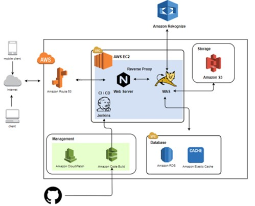
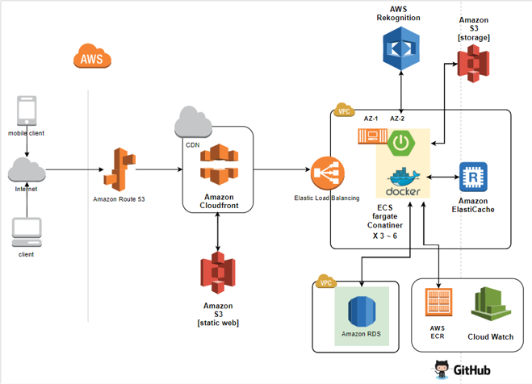
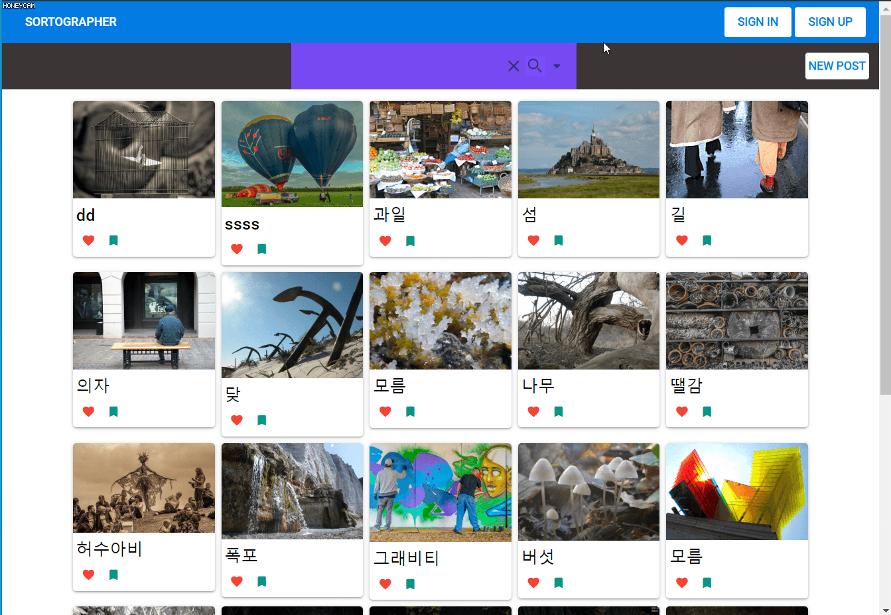

# AWS를 활용한 딥러닝 기반 이미지 자동 분류 사진첩  

* 발표자료는 document 안에

목차.  
[1. 주요 특징](#item1)  
[2. 시연 화면](#item2)  
[3. 도움이 되었던 예제들](#item3)  
[4. 느낀점 + 아쉬웠던 부분 + 개선점이 필요한 부분](#item4)  
[5. 사용 기술](#item5) 
****

##1. 주요 특징

+ 로그인 :arrow_right: Spring Security + JWT
+ Persistance Layer  
  + JPA + QueryDSL 사용

+ 아키텍쳐 설계도
  
인프라 | 중간 발표 | 기말 발표 
--- | --- | --- 
AWS |  |  

##2. 시연 화면
이미지 등록 | 이미지 검색 
| --- | --- 
|  | 

##3. 도움이 되었던 예제들
+ Spring Security + JWT 기반 인증 & 인가
  - https://github.com/murraco/spring-boot-jwt  

+ Spring Boot 가이드 프로젝트 (참고 한 레포) 
  - https://github.com/choiwono/pouch
    - Spring Boot, JPA, vue.js

+ 차근차근 배워보는 ECS fargate
  - youtube  : https://www.youtube.com/watch?v=blDvDDZ1ngg&t=1222s
  - 발표 자료 : https://www.slideshare.net/HyunMookChoi/fargate-ecs-with-vpc-1
  
##4.느낀점 + 아쉬웠던 부분 + 개선점이 필요한 부분
1. CloudFront + S3 + ECS fargate 조합에서 SSL 인증서까지 적용 못함 (HTTPS, HTTP 2.0 X)
2. 기술 스택을 무리하게 끌어올린 나머지 구현부분이 약간 미약함.
3. 클라우드를 통해 개발 뿐 아니라 인프라에 관해 더 자세히 알 수 있었다. 
4. 프로젝트를 계속 개선하고 싶은데... 인프라가...크레딧이...부족해요..
5. jenkins를 통한 CI/CD도 해보고 싶었는데 ㅜㅜ 시간이 부족했다.
6. ㄴ> 시간 때문에 redis도 재대로 적용하지 못한점 ㅜㅜ

**** 
##5. 사용 기술
+ FRONT END
  + Vue.js [2.6.10]
    + Quasar [1.4.3]
  + Webpack
     
+ BACK END
  + Web Application Server
    + Spring Boot [2.2.0]
      + Spring Security
      + Spring Data Redis
        + Lettuce
      + Spring Data JPA
        + Hibernate
        + QueryDSL
  
  + Database
    + MySQL 5.7
  
  + In-Memory Database (ElastiCache)
    + Redis
    
+ Infra [AWS]
  + AMAZON Rekognition
  + AMAZON ECS fargate
  + AMAZON ECR
  + AMAZON ELB
  + AMAZON S3
  + AMAZON RDS
  + AMAZON ElastiCache
  + AMAZON Route 53
  + AMAZON CloudFront
  + AMAZON CloudWatch